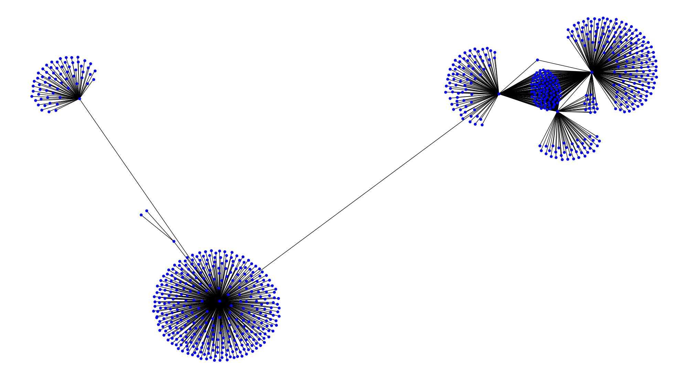

# spidy 2.0

This will be the second version of the
[spidy Web Crawler](https://github.com/rivermont/spidy).

It will build on the ideas and basic code of version 1 but will mostly
be written from scratch.

# Index

  - [Top](#spidy-2-0)
  - [Index](#index)
  - [Usage](#usage)
  - [Notes](#notes)

***

## Usage
Command arguments coming soon, but for now simple

> python3 spidy/crawler.py

or

> ./spidy/crawler.py

***

The following was written completely separately from the current code
and the two have no correlation, though they share common concepts.

## Notes

* GUI (cross-platform)
* Command-line arguments
* Create map of crawled internet
* As few imports from outside libraries as possible
* Cleaner, shorter code than 1.0
* Improvements from 1.0:
  - Need different logging/verbosity levels
  - Ability to log date for long crawls
  - Set storage and memory limits
  - Scan for available config files and offer as options
  - Better, more formal documentation
  - Cleaner multithreading
* Check HTTP status code first!
* Trap detection and avoidance
* Different politeness levels:
  - Robots.txt
  - Request timeouts
* Safely close on `KeyboardInterrupt`

Problems faced in Spidy 1.0 (as found in GitHub Issues):

* Robots.txt being queried every time
  - Needed to store in a database
* Accepted incorrect inputs and took default
  - Added validity check
* Individual threads saving where entire crawl should pause and save
* Errors when trying to parse empty pages
  - Added length check

Anticipated Errors:

* Incorrect robots.txt URL resulting in crawling everything
